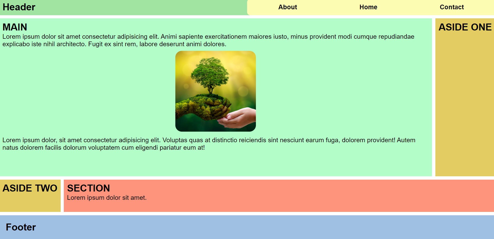
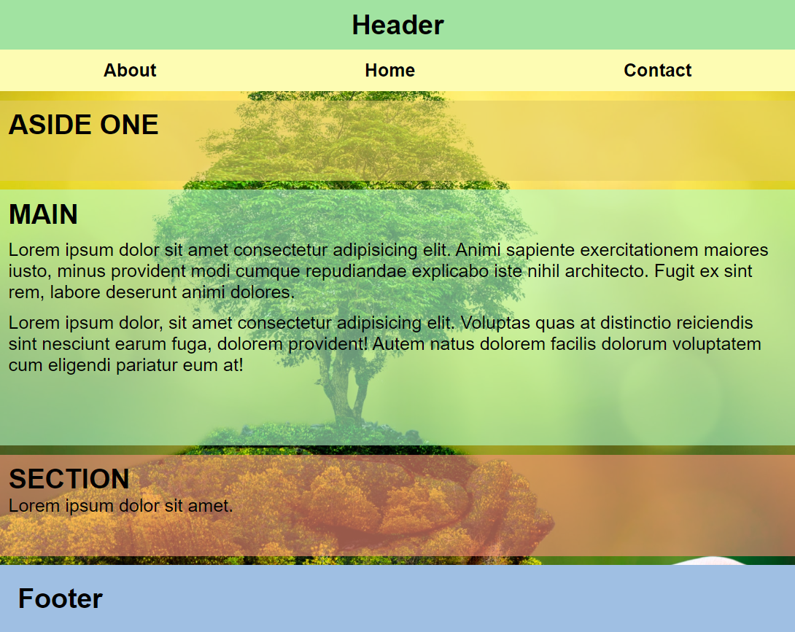

## Created basic web site with HTML5 and CSS3

---

<ul>
    <li>HTML5 semantic structure is used.</li>
    <li>The page was created using flex and grid.</li>
    <li>An example was made for mobile.</li>
</ul>

---

### WEB SITE

---

### RESPOSIVE

