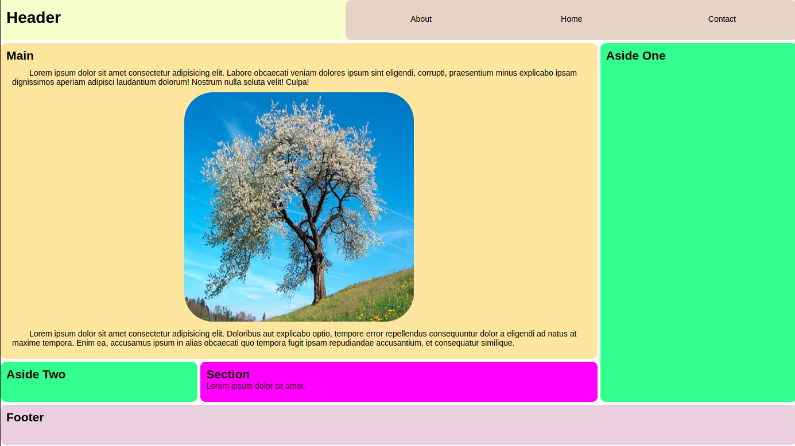
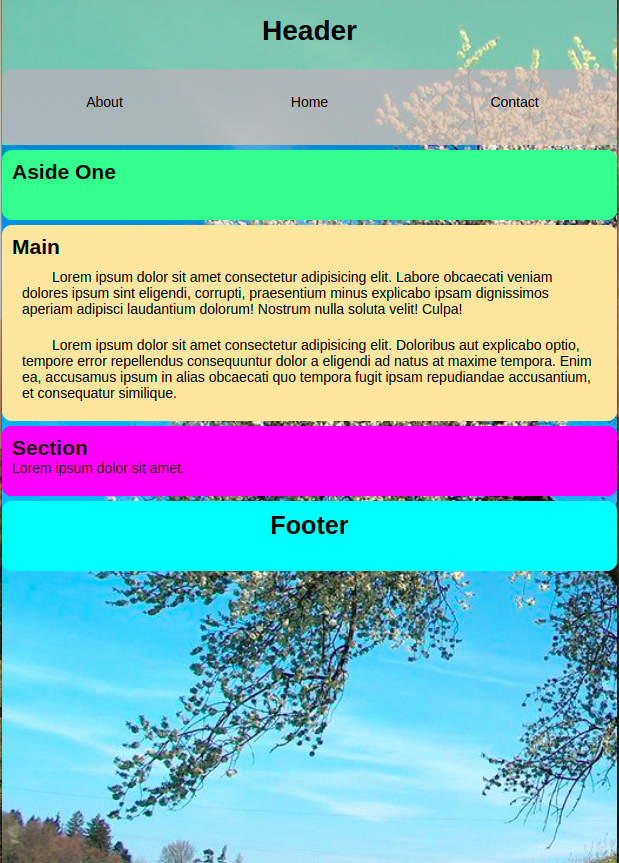

## CSS-Bootstrap Homework

---

---

### Görev

1. CSS` in Flex ve Grid (Grid-template-areas)  özelliklerini kullanarak ekteki sayfa yapisini olusturalim.

2. Sayfamizdaki bölümleri olustururken html dosyasinda Semantik Elementleri kullanalim.

* Bonus: Media Query kullanarak asagidaki tablet görünümünü olusturalim.

##### Sitemizi

- [x] _HTML5_
- [x] _CSS_

##### kullanarak olusturalim.
---

## Basarilar

