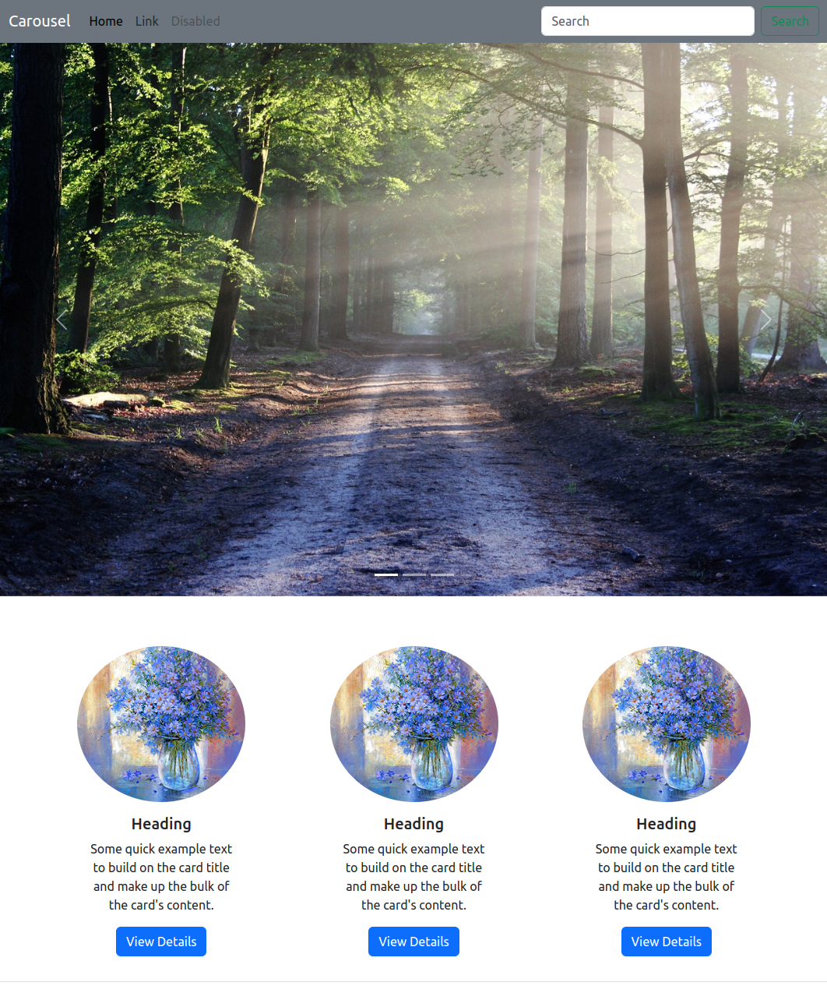
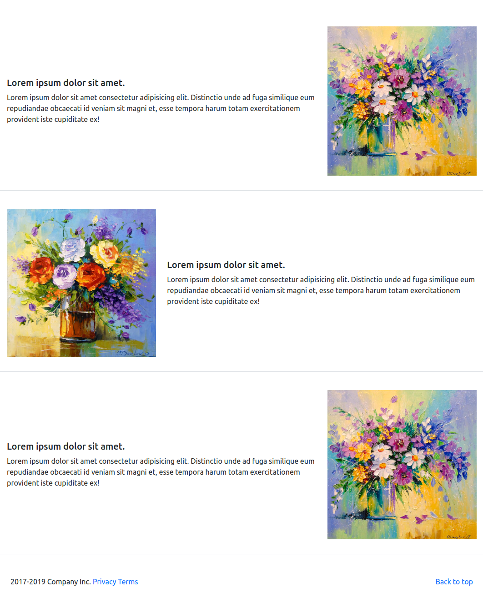
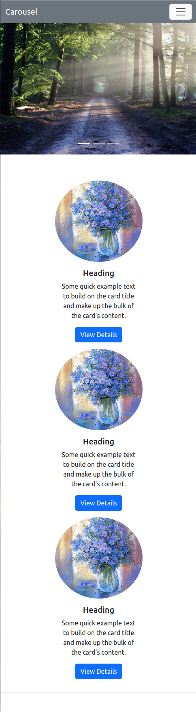
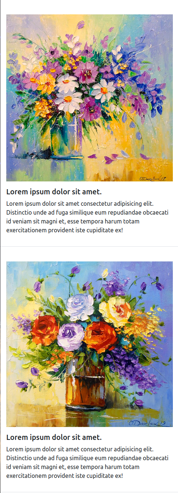
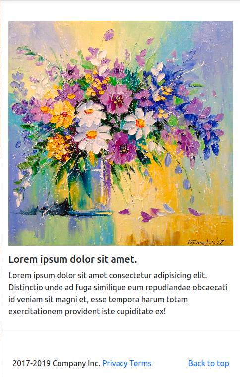

## Bootstrap Homework

---

---

### Görev

1. Bootstrap kullanarak sayfamizi ekran görüntüsündeki gibi olusturalim.

- images klasöründeki 1,2 ve 3 numarali resimleri Carousel yapiminda kullanalim.
- 4 numarali resimi cardlar icin kullanalim.
- 5, 6 ve 7 numarali resimleri aciklama metinleriyle birlikte kullanalim.

2. Sayfamizin mobil görünümünün asagidaki gibi olmasini saglayalim.

* Not: Olusturdugumuz ´Back to Top´ linkinin calistigindan emin olalim.

##### Sitemizi

- [x] _HTML5_
- [x] _BOOTSTRAP_

##### kullanarak olusturalim.
---

## Basarilar

