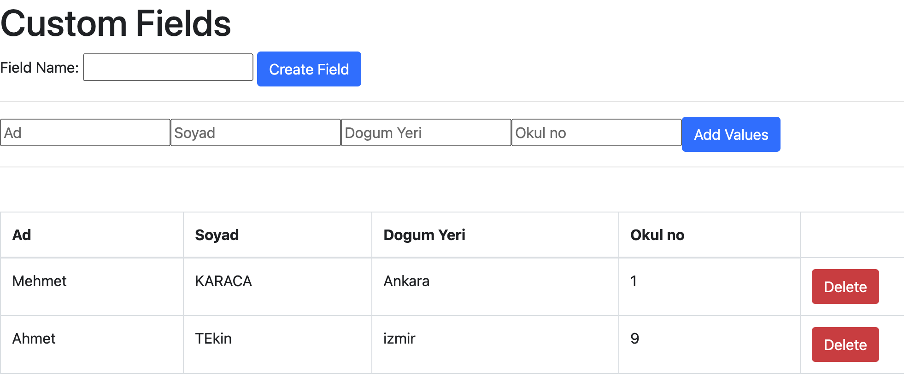

Odev 3 bölümden Olusuyor: Custom alanlarin oluşturabildiği bölüm, Değer ekleme bölümü ve eklenen degerlerin gosterilecegi bir tablo olusturulacak.

1. Custom alan Oluşturma Bölümü (form)
Bu bölümde kullanıcılar, bir alan adını tanımlamak için bir input ve bir buton kullanacaklar. Kullanıcı bir alan adı girdikten sonra, formda bu custom alan için bir text input oluşturulacak ve ayrıca tablo başlığı olarak da eklenecek.

2. Değer Ekleme Bölümü (form)
Bu bölümde, önceden oluşturdukları custom alanlar için değerler girilecek. Bu bölümdeki her custom alan için, bir input olacak sekilde form dinamik olarak oluşturulur. Ayrica degerleri eklemek icin bir buton yerlestirilecek. Kullanıcılar formu doldurduktan sonra bu değer tabloya eklenir.

3. Tablo (table)
Bu bölümde kullanıcılar, custom alanlara ekledikleri değerleri görebilirler. Tablodaki kolan basliklari, custom inputların adlarıyla aynı olmalıdır. Her satirin sonunda "Sil" butonu yer alir. Bu buton ile ilgili kaydin silinmesi saglanir.

